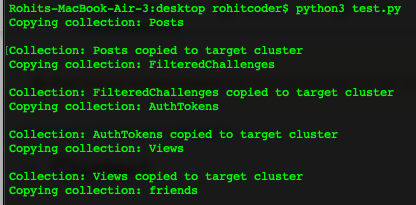

# Migrate-MongoDB-Cloner

While working on a dev environment (Free MongoDB) i was trying to migrate to a paid one, I was trying to find a good tool which can "simply migrate" one cluster to remote (Prod/Staging) cluster.

MongoDB Atlas Paid version allows you to migrate from any source MongoDB but it seems, there are lot of restrictions because of which i wasn't able to migrate, tried to lot of tools and did lot of stackoverflow research i didn't find something simple and useful, So i created this simple tool which simply migrates your cluster and nothing else.


## Requirements
```
pip3 install pymongo
```

## Usage
1. Open run.py with any editor and modify Connection_STRING_HERE, source_cluster_name_here
2. Now run 
```
python3 run.py
```
3. If everything works perfectly then you'll see an output somehting like this


